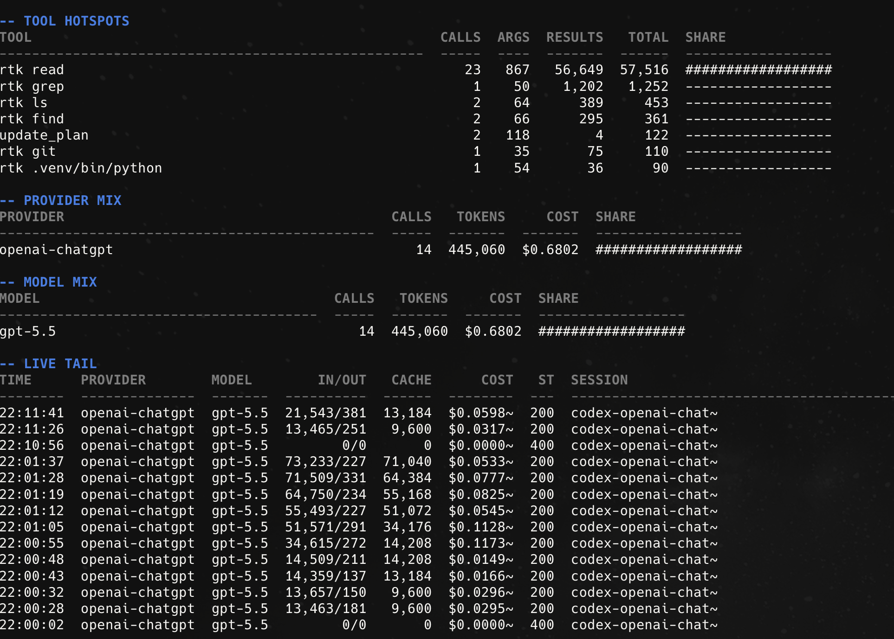
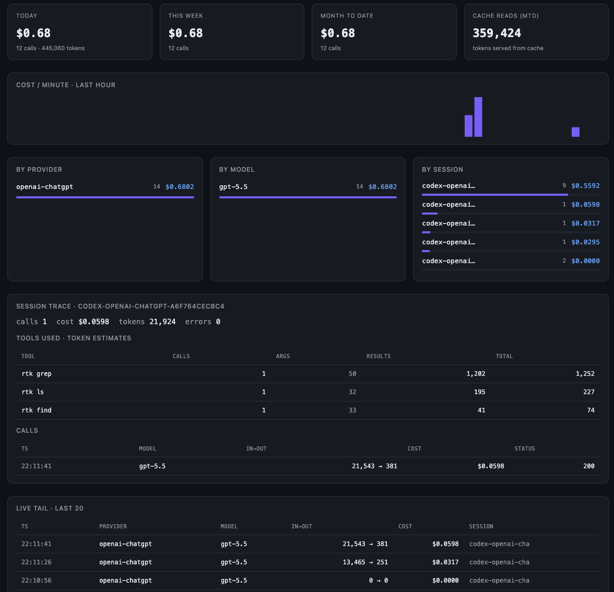

# tokview

> Live token spend for Codex, Claude Code, and LLM SDK traffic. Local, terminal-first, no hosted service.

[](https://github.com/chopratejas/tokview/actions/workflows/ci.yml)
[](https://pypi.org/project/token-viewer/)
[](LICENSE)
[](https://www.python.org/downloads/)

`tokview` shows where your agent tokens go while the agent is running: sessions, requests, models, cache reads, estimated spend, and tool-result hotspots.

It is built for workflows normal token counters miss: Codex and Claude Code subscription sessions, OAuth traffic, WebSockets, streaming responses, provider-compatible SDKs, and tool outputs that get resent into later turns.

## See It

The terminal TUI is the main experience. It gives you live spend, sessions, request tails, provider/model mix, cache reads, and tool hotspots without opening a browser.



The browser dashboard is optional, but useful when you want a wider visual scan of spend, cache usage, sessions, and recent calls.



## Run It

Install the package. The PyPI name is `token-viewer`; the command is `tokview`.

```bash
uv tool install token-viewer
# or
pipx install token-viewer
```

Open the live terminal dashboard:

```bash
tokview show --watch
```

Run your agent through tokview in another terminal:

```bash
tokview wrap codex
# or
tokview wrap claude
```

Pass agent flags normally:

```bash
tokview wrap codex --model gpt-5.5 --search
tokview wrap claude --model opus
```

`wrap` starts one shared local proxy if needed. Multiple Codex and Claude sessions can run at once and appear as separate sessions in `tokview show`.

## What You Get

- Live spend by session, request, provider, and model.
- Input, output, cache-read, cache-write, and reasoning token counters when reported.
- Estimated equivalent API spend for subscription traffic.
- Tool argument/result token estimates, including Codex shell command families such as `read`, `grep`, `find`, `pytest`, and `npm`.
- A local SQLite history at `~/.tokview/db.sqlite`.

Tool-level values are token estimates, not dollars. Providers bill per model call, and cache discounts make per-tool dollars misleading.

## Works With

| Client | Use | Notes |
| --- | --- | --- |
| Codex subscription | `tokview wrap codex` | Handles HTTP and WebSocket Responses traffic, including ChatGPT-auth Codex backend calls. |
| Claude Code subscription / OAuth | `tokview wrap claude` | Handles native Anthropic Messages forwarding for subscription/OAuth and API-key traffic. |
| OpenAI-compatible SDKs | `OPENAI_BASE_URL=http://127.0.0.1:4000/v1` | API-key traffic through LiteLLM. |
| Anthropic-compatible SDKs | `ANTHROPIC_BASE_URL=http://127.0.0.1:4000` | Native Anthropic-compatible proxying. |
| Gemini-compatible SDKs | `GOOGLE_BASE_URL=http://127.0.0.1:4000` | Direct proxy mode. |

No app instrumentation is required. If a client can use a provider-compatible base URL, tokview can usually observe it.

## Compared To Other Counters

| Approach | Good for | tokview adds |
| --- | --- | --- |
| Provider dashboards | Billing totals | Local session/request/tool views. |
| SDK observability | Instrumented apps | CLI wrapping and localhost-only capture. |
| Claude/Codex log readers | Post-hoc summaries | Live proxy traffic and SDK coverage. |
| Tokenizers | Prompt-size estimates | Provider usage, cache counters, streaming data, and cost. |

## Commands

```bash
tokview wrap codex [CODEX_ARGS...]
tokview wrap claude [CLAUDE_ARGS...]
tokview unwrap codex

tokview show --watch
tokview show --latest
tokview show --session SESSION_ID

tokview status
tokview logs [-f] [-n N]
tokview export --since YYYY-MM-DD --format csv|json
tokview reset
tokview version
```

`tokview start` and `tokview stop` exist for debugging, but the normal workflow is `tokview wrap ...` plus `tokview show`.

## How It Works

```text
Codex / Claude / SDKs -> tokview local proxy -> provider backend
                                |
                                +-> SQLite ~/.tokview/db.sqlite
                                +-> tokview show --watch
                                +-> optional browser dashboard
```

- API-key traffic uses LiteLLM where that is the right routing layer.
- Codex subscription traffic uses tokview's native Codex adapter so HTTP and WebSocket Responses traffic are observable.
- Claude Code subscription/OAuth traffic uses tokview's native Anthropic adapter.
- Costs marked with `~` are estimated equivalent API spend because subscription products do not bill per request like API-key calls.

## Data And Privacy

By default tokview stores accounting metadata only:

- timestamp, latency, status
- provider, model, session id
- input/output/cache/reasoning token counters
- cost or estimated equivalent API cost
- tool names with estimated argument/result tokens

No prompt text or response text is stored by default. Provider API keys come from the environment; tokview forwards them and does not persist them.

## Configuration

`~/.tokview/config.yaml` is created automatically and defaults to localhost-only:

```yaml
proxy:      { port: 4000, bind: 127.0.0.1 }
dashboard:  { port: 3000, bind: 127.0.0.1 }
storage:    { path: ~/.tokview/db.sqlite }
retention:  { days: 90 }
capture:    { prompts: false, responses: false }
```

## Security

- Binds to `127.0.0.1` by default.
- Stores data locally in `~/.tokview/db.sqlite`.
- Uses LiteLLM's installed pricing map instead of runtime pricing fetches.
- Requires no account, cloud service, or telemetry.

See [SECURITY.md](SECURITY.md).

## Status

`v0.0.x` alpha. Best today for Codex, Claude Code, OpenAI-compatible SDKs, Anthropic-compatible SDKs, Gemini-compatible SDKs, and LiteLLM-supported providers routed through the proxy.

## Contributing

```bash
python -m venv .venv
. .venv/bin/activate
pip install -e ".[dev]"
ruff check src tests
pytest -q
```

See [CONTRIBUTING.md](CONTRIBUTING.md).

## License

[MIT](LICENSE). Bundled open-source dependencies are credited in [NOTICES.md](NOTICES.md).
